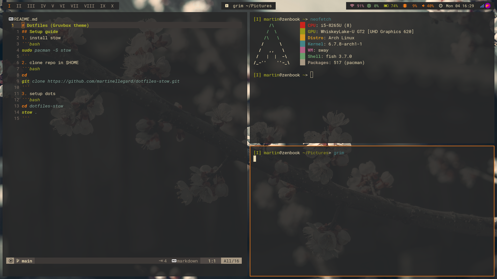
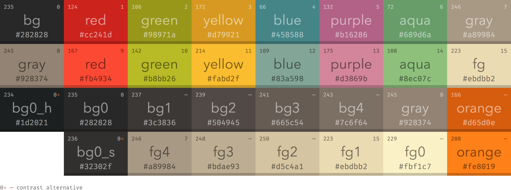

# Dotfiles (Gruvbox theme)

todo split repo into mulitple
1. Core(plattform shared applications)
    - vim/helix/tmux/btm
    - Kitty/wezterm
    - Wallpapers
2. Linux
    - Sway
    - Hyprland
    - I3
    - foot terminal
2. Mac Os
    - Yabai
    - Skhd

## Setup guide

1. install stow 
```bash
sudo pacman -S stow
```
2. clone repo in $HOME
```bash
cd
git clone https://github.com/martinellegard/dotfiles-stow.git
```
3. setup dots
```bash
cd dotfiles-stow
stow .
```
## Sway


## I3

Almost complete
## Hyprland

TODO

## Color-scheme

1. Gruvbox

2. TODO: Catpouccin Mocha(better support)

